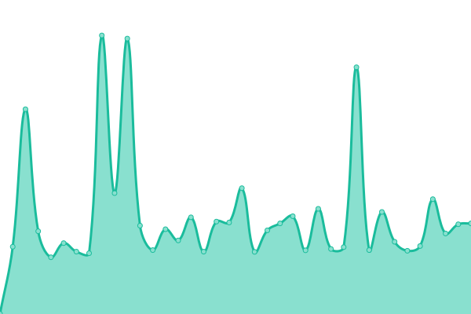
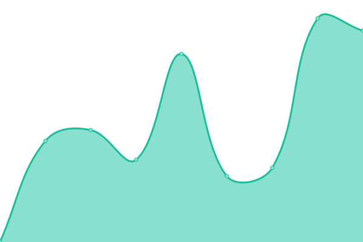
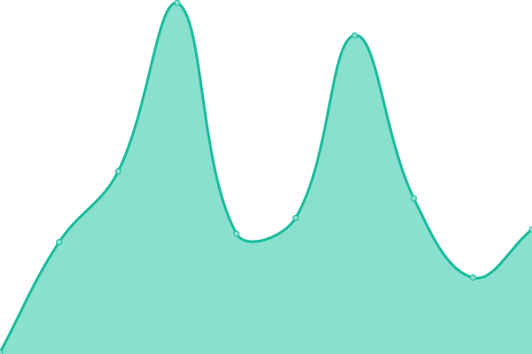

# [📈 Live Status](https://status.skiddle.id): <!--live status--> **🟧 Partial outage**

This repository contains the open-source uptime monitor and status page for [Skiddle-ID](https://status.skiddle.id), powered by [Upptime](https://github.com/upptime/upptime).

With [Upptime](https://upptime.js.org), you can get your own unlimited and free uptime monitor and status page, powered entirely by a GitHub repository. We use [Issues](https://github.com/Skiddle-ID/monitoring/issues) as incident reports, [Actions](https://github.com/Skiddle-ID/monitoring/actions) as uptime monitors, and [Pages](https://status.skiddle.id) for the status page.

<!--start: status pages-->
<!-- This summary is generated by Upptime (https://github.com/upptime/upptime) -->
<!-- Do not edit this manually, your changes will be overwritten -->
<!-- prettier-ignore -->
| URL | Status | History | Response Time | Uptime |
| --- | ------ | ------- | ------------- | ------ |
|  [Main Website](https://skiddle.id) | 🟩 Up | [main-website.yml](https://github.com/Skiddle-ID/monitoring/commits/HEAD/history/main-website.yml) | 

 351ms
     
 | 

<a href="https://monitor.skiddle.id/history/main-website">100.00%</a>
    

|  [Private Wiki (wiki.skiddle.id)](https://wiki.skiddle.id) | 🟩 Up | [private-wiki-wiki-skiddle-id.yml](https://github.com/Skiddle-ID/monitoring/commits/HEAD/history/private-wiki-wiki-skiddle-id.yml) | 

 199ms
     
 | 

<a href="https://monitor.skiddle.id/history/private-wiki-wiki-skiddle-id">100.00%</a>
    

|  [Mail System](https://skiddle.id) | 🟩 Up | [mail-system.yml](https://github.com/Skiddle-ID/monitoring/commits/HEAD/history/mail-system.yml) | 

 48ms
     
 | 

<a href="https://monitor.skiddle.id/history/mail-system">100.00%</a>
    

|  [Bluesky PDS](https://pds.skiddle.id) | 🟥 Down | [bluesky-pds.yml](https://github.com/Skiddle-ID/monitoring/commits/HEAD/history/bluesky-pds.yml) | 

 425ms
     
 | 

<a href="https://monitor.skiddle.id/history/bluesky-pds">0.00%</a>
    

|  CheckDomain API | 🟩 Up | [check-domain-api.yml](https://github.com/Skiddle-ID/monitoring/commits/HEAD/history/check-domain-api.yml) | 

 404ms
     
 | 

<a href="https://monitor.skiddle.id/history/check-domain-api">100.00%</a>
    

|  [Private Git](https://git.skiddle.cloud) | 🟥 Down | [private-git.yml](https://github.com/Skiddle-ID/monitoring/commits/HEAD/history/private-git.yml) | 

 0ms
     
 | 

<a href="https://monitor.skiddle.id/history/private-git">0.00%</a>
    

|  Skiddle CDN | 🟩 Up | [skiddle-cdn.yml](https://github.com/Skiddle-ID/monitoring/commits/HEAD/history/skiddle-cdn.yml) | 

 288ms
     
 | 

<a href="https://monitor.skiddle.id/history/skiddle-cdn">100.00%</a>
    

<!--end: status pages-->

[**Visit our status website →**](https://status.skiddle.id)

## 📄 License

- Powered by: [Upptime](https://github.com/upptime/upptime)
- Code: [MIT](./LICENSE) © [Anand Chowdhary](https://anandchowdhary.com), supported by [Pabio](https://pabio.com)
- Data in the `./history` directory: [Open Database License](https://opendatacommons.org/licenses/odbl/1-0/)
