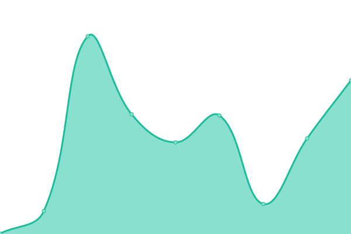
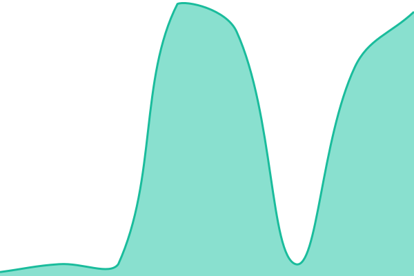
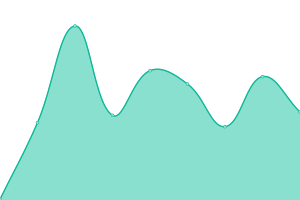
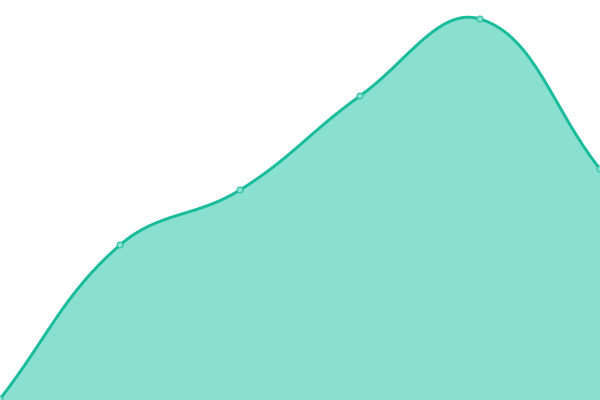
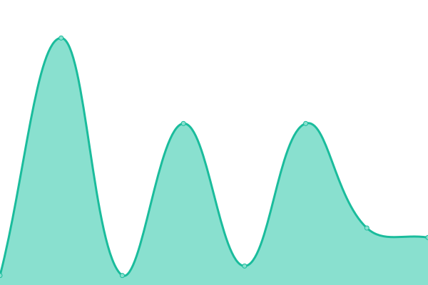

# [📈 Live Status](https://status.skiddle.id): <!--live status--> **🟩 All systems operational**

This repository contains the open-source uptime monitor and status page for [Skiddle-ID](https://status.skiddle.id), powered by [Upptime](https://github.com/upptime/upptime).

With [Upptime](https://upptime.js.org), you can get your own unlimited and free uptime monitor and status page, powered entirely by a GitHub repository. We use [Issues](https://github.com/Skiddle-ID/monitoring/issues) as incident reports, [Actions](https://github.com/Skiddle-ID/monitoring/actions) as uptime monitors, and [Pages](https://status.skiddle.id) for the status page.

<!--start: status pages-->
<!-- This summary is generated by Upptime (https://github.com/upptime/upptime) -->
<!-- Do not edit this manually, your changes will be overwritten -->
<!-- prettier-ignore -->
| URL | Status | History | Response Time | Uptime |
| --- | ------ | ------- | ------------- | ------ |
|  [skiddle.id](https://skiddle.id) | 🟩 Up | [skiddle-id.yml](https://github.com/Skiddle-ID/monitoring/commits/HEAD/history/skiddle-id.yml) | 

 129ms
     
 | 

<a href="https://monitor.skiddle.id/history/skiddle-id">100.00%</a>
    

|  [skiddle.blue](https://skiddle.blue) | 🟩 Up | [skiddle-blue.yml](https://github.com/Skiddle-ID/monitoring/commits/HEAD/history/skiddle-blue.yml) | 

 217ms
     
 | 

<a href="https://monitor.skiddle.id/history/skiddle-blue">100.00%</a>
    

|  [Private Wiki (wiki.skiddle.id)](https://wiki.skiddle.id) | 🟩 Up | [private-wiki-wiki-skiddle-id.yml](https://github.com/Skiddle-ID/monitoring/commits/HEAD/history/private-wiki-wiki-skiddle-id.yml) | 

 186ms
     
 | 

<a href="https://monitor.skiddle.id/history/private-wiki-wiki-skiddle-id">100.00%</a>
    

|  Mail System | 🟩 Up | [mail-system.yml](https://github.com/Skiddle-ID/monitoring/commits/HEAD/history/mail-system.yml) | 

 46ms
     
 | 

<a href="https://monitor.skiddle.id/history/mail-system">100.00%</a>
    

|  [Skiddle API (Honolife API)](https://api.skiddle.id) | 🟩 Up | [skiddle-api-honolife-api.yml](https://github.com/Skiddle-ID/monitoring/commits/HEAD/history/skiddle-api-honolife-api.yml) | 

 144ms
     
 | 

<a href="https://monitor.skiddle.id/history/skiddle-api-honolife-api">100.00%</a>
    

|  [Skiddle Vault](https://vault.skiddle.id) | 🟩 Up | [skiddle-vault.yml](https://github.com/Skiddle-ID/monitoring/commits/HEAD/history/skiddle-vault.yml) | 

 923ms
     
 | 

<a href="https://monitor.skiddle.id/history/skiddle-vault">100.00%</a>
    

|  [Skiddle Links](https://skiddle.link) | 🟩 Up | [skiddle-links.yml](https://github.com/Skiddle-ID/monitoring/commits/HEAD/history/skiddle-links.yml) | 

 118ms
     
 | 

<a href="https://monitor.skiddle.id/history/skiddle-links">100.00%</a>
    

|  Skiddle CDN | 🟩 Up | [skiddle-cdn.yml](https://github.com/Skiddle-ID/monitoring/commits/HEAD/history/skiddle-cdn.yml) | 

 349ms
     
 | 

<a href="https://monitor.skiddle.id/history/skiddle-cdn">100.00%</a>
    

|  SG-1 Nodes | 🟩 Up | [sg-1-nodes.yml](https://github.com/Skiddle-ID/monitoring/commits/HEAD/history/sg-1-nodes.yml) | 

 186ms
     
 | 

<a href="https://monitor.skiddle.id/history/sg-1-nodes">100.00%</a>
    

|  SG-2 Nodes | 🟩 Up | [sg-2-nodes.yml](https://github.com/Skiddle-ID/monitoring/commits/HEAD/history/sg-2-nodes.yml) | 

 188ms
     
 | 

<a href="https://monitor.skiddle.id/history/sg-2-nodes">100.00%</a>
    

|  SG-3 Nodes | 🟩 Up | [sg-3-nodes.yml](https://github.com/Skiddle-ID/monitoring/commits/HEAD/history/sg-3-nodes.yml) | 

 186ms
     
 | 

<a href="https://monitor.skiddle.id/history/sg-3-nodes">100.00%</a>
    

|  SG-4 Nodes | 🟩 Up | [sg-4-nodes.yml](https://github.com/Skiddle-ID/monitoring/commits/HEAD/history/sg-4-nodes.yml) | 

 135ms
     
 | 

<a href="https://monitor.skiddle.id/history/sg-4-nodes">100.00%</a>
    

|  ID-1 Nodes | 🟩 Up | [id-1-nodes.yml](https://github.com/Skiddle-ID/monitoring/commits/HEAD/history/id-1-nodes.yml) | 

 199ms
     
 | 

<a href="https://monitor.skiddle.id/history/id-1-nodes">100.00%</a>
    

|  ID-2 Nodes | 🟩 Up | [id-2-nodes.yml](https://github.com/Skiddle-ID/monitoring/commits/HEAD/history/id-2-nodes.yml) | 

 199ms
     
 | 

<a href="https://monitor.skiddle.id/history/id-2-nodes">100.00%</a>
    

|  ID-3 Nodes | 🟩 Up | [id-3-nodes.yml](https://github.com/Skiddle-ID/monitoring/commits/HEAD/history/id-3-nodes.yml) | 

 198ms
     
 | 

<a href="https://monitor.skiddle.id/history/id-3-nodes">100.00%</a>
    

|  ID-4 Nodes | 🟩 Up | [id-4-nodes.yml](https://github.com/Skiddle-ID/monitoring/commits/HEAD/history/id-4-nodes.yml) | 

 199ms
     
 | 

<a href="https://monitor.skiddle.id/history/id-4-nodes">100.00%</a>
    

|  ID-5 Nodes | 🟩 Up | [id-5-nodes.yml](https://github.com/Skiddle-ID/monitoring/commits/HEAD/history/id-5-nodes.yml) | 

 200ms
     
 | 

<a href="https://monitor.skiddle.id/history/id-5-nodes">100.00%</a>
    

|  ID-6 Nodes | 🟩 Up | [id-6-nodes.yml](https://github.com/Skiddle-ID/monitoring/commits/HEAD/history/id-6-nodes.yml) | 

 199ms
     
 | 

<a href="https://monitor.skiddle.id/history/id-6-nodes">100.00%</a>
    

|  ID-7 Nodes | 🟩 Up | [id-7-nodes.yml](https://github.com/Skiddle-ID/monitoring/commits/HEAD/history/id-7-nodes.yml) | 

 199ms
     
 | 

<a href="https://monitor.skiddle.id/history/id-7-nodes">100.00%</a>
    

|  CDN Nodes 1 | 🟩 Up | [cdn-nodes-1.yml](https://github.com/Skiddle-ID/monitoring/commits/HEAD/history/cdn-nodes-1.yml) | 

 46ms
     
 | 

<a href="https://monitor.skiddle.id/history/cdn-nodes-1">100.00%</a>
    

|  CDN Nodes 2 | 🟩 Up | [cdn-nodes-2.yml](https://github.com/Skiddle-ID/monitoring/commits/HEAD/history/cdn-nodes-2.yml) | 

 11ms
     
 | 

<a href="https://monitor.skiddle.id/history/cdn-nodes-2">100.00%</a>
    

<!--end: status pages-->

[**Visit our status website →**](https://status.skiddle.id)

## 📄 License

- Powered by: [Upptime](https://github.com/upptime/upptime)
- Code: [MIT](./LICENSE) © [Anand Chowdhary](https://anandchowdhary.com), supported by [Pabio](https://pabio.com)
- Data in the `./history` directory: [Open Database License](https://opendatacommons.org/licenses/odbl/1-0/)
