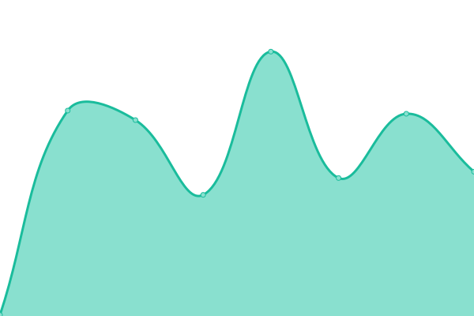

# [📈 Live Status](https://status.skiddle.id): <!--live status--> **🟧 Partial outage**

This repository contains the open-source uptime monitor and status page for [Skiddle-ID](https://status.skiddle.id), powered by [Upptime](https://github.com/upptime/upptime).

With [Upptime](https://upptime.js.org), you can get your own unlimited and free uptime monitor and status page, powered entirely by a GitHub repository. We use [Issues](https://github.com/Skiddle-ID/monitoring/issues) as incident reports, [Actions](https://github.com/Skiddle-ID/monitoring/actions) as uptime monitors, and [Pages](https://status.skiddle.id) for the status page.

<!--start: status pages-->
<!-- This summary is generated by Upptime (https://github.com/upptime/upptime) -->
<!-- Do not edit this manually, your changes will be overwritten -->
<!-- prettier-ignore -->
| URL | Status | History | Response Time | Uptime |
| --- | ------ | ------- | ------------- | ------ |
|  [Main Website](https://skiddle.id) | 🟩 Up | [main-website.yml](https://github.com/Skiddle-ID/monitoring/commits/HEAD/history/main-website.yml) | 

 558ms
     
 | 

<a href="https://status.skiddle.id/history/main-website">100.00%</a>
    

|  [Private Wiki (wiki.skiddle.id)](https://wiki.skiddle.id) | 🟩 Up | [private-wiki-wiki-skiddle-id.yml](https://github.com/Skiddle-ID/monitoring/commits/HEAD/history/private-wiki-wiki-skiddle-id.yml) | 

 191ms
     
 | 

<a href="https://status.skiddle.id/history/private-wiki-wiki-skiddle-id">100.00%</a>
    

|  [Mail System](https://skiddle.id) | 🟩 Up | [mail-system.yml](https://github.com/Skiddle-ID/monitoring/commits/HEAD/history/mail-system.yml) | 

 17ms
     
 | 

<a href="https://status.skiddle.id/history/mail-system">100.00%</a>
    

|  [NTFY Services](https://ntfy.skiddle.id) | 🟥 Down | [ntfy-services.yml](https://github.com/Skiddle-ID/monitoring/commits/HEAD/history/ntfy-services.yml) | 

 105ms
     
 | 

<a href="https://status.skiddle.id/history/ntfy-services">0.00%</a>
    

|  [Skiddle Network (FireFish)](https://skiddle.network/) | 🟩 Up | [skiddle-network-fire-fish.yml](https://github.com/Skiddle-ID/monitoring/commits/HEAD/history/skiddle-network-fire-fish.yml) | 

 644ms
     
 | 

<a href="https://status.skiddle.id/history/skiddle-network-fire-fish">100.00%</a>
    

|  API Services | 🟩 Up | [api-services.yml](https://github.com/Skiddle-ID/monitoring/commits/HEAD/history/api-services.yml) | 

 272ms
     
 | 

<a href="https://status.skiddle.id/history/api-services">100.00%</a>
    

|  Metrics Services | 🟩 Up | [metrics-services.yml](https://github.com/Skiddle-ID/monitoring/commits/HEAD/history/metrics-services.yml) | 

 578ms
     
 | 

<a href="https://status.skiddle.id/history/metrics-services">100.00%</a>
    

|  CheckDomain API | 🟩 Up | [check-domain-api.yml](https://github.com/Skiddle-ID/monitoring/commits/HEAD/history/check-domain-api.yml) | 

 8064ms
     
 | 

<a href="https://status.skiddle.id/history/check-domain-api">100.00%</a>
    

|  [Private Git](https://git.skiddle.id) | 🟥 Down | [private-git.yml](https://github.com/Skiddle-ID/monitoring/commits/HEAD/history/private-git.yml) | 

 99ms
     
 | 

<a href="https://status.skiddle.id/history/private-git">0.00%</a>
    

|  Skiddle CDN | 🟩 Up | [skiddle-cdn.yml](https://github.com/Skiddle-ID/monitoring/commits/HEAD/history/skiddle-cdn.yml) | 

 1539ms
     
 | 

<a href="https://status.skiddle.id/history/skiddle-cdn">100.00%</a>
    

|  [Dummy Wordpress](https://skiddle.my.id) | 🟩 Up | [dummy-wordpress.yml](https://github.com/Skiddle-ID/monitoring/commits/HEAD/history/dummy-wordpress.yml) | 

 2258ms
     
 | 

<a href="https://status.skiddle.id/history/dummy-wordpress">100.00%</a>
    

|  Seedbox & Plex | 🟩 Up | [seedbox-and-plex.yml](https://github.com/Skiddle-ID/monitoring/commits/HEAD/history/seedbox-and-plex.yml) | 

 1226ms
     
 | 

<a href="https://status.skiddle.id/history/seedbox-and-plex">100.00%</a>
    

|  [Maloja](https://listen.skiddle.id) | 🟩 Up | [maloja.yml](https://github.com/Skiddle-ID/monitoring/commits/HEAD/history/maloja.yml) | 

 2070ms
     
 | 

<a href="https://status.skiddle.id/history/maloja">100.00%</a>
    

|  GITHUB CI Nodes | 🟩 Up | [github-ci-nodes.yml](https://github.com/Skiddle-ID/monitoring/commits/HEAD/history/github-ci-nodes.yml) | 

 267ms
     
 | 

<a href="https://status.skiddle.id/history/github-ci-nodes">100.00%</a>
    

|  SG1 Nodes | 🟩 Up | [sg-1-nodes.yml](https://github.com/Skiddle-ID/monitoring/commits/HEAD/history/sg-1-nodes.yml) | 

 195ms
     
 | 

<a href="https://status.skiddle.id/history/sg-1-nodes">65.95%</a>
    

|  SG2 Nodes | 🟩 Up | [sg-2-nodes.yml](https://github.com/Skiddle-ID/monitoring/commits/HEAD/history/sg-2-nodes.yml) | 

 195ms
     
 | 

<a href="https://status.skiddle.id/history/sg-2-nodes">100.00%</a>
    

|  SG3 Nodes | 🟩 Up | [sg-3-nodes.yml](https://github.com/Skiddle-ID/monitoring/commits/HEAD/history/sg-3-nodes.yml) | 

 194ms
     
 | 

<a href="https://status.skiddle.id/history/sg-3-nodes">100.00%</a>
    

|  DE1 Nodes | 🟩 Up | [de-1-nodes.yml](https://github.com/Skiddle-ID/monitoring/commits/HEAD/history/de-1-nodes.yml) | 

 119ms
     
 | 

<a href="https://status.skiddle.id/history/de-1-nodes">100.00%</a>
    

<!--end: status pages-->

[**Visit our status website →**](https://status.skiddle.id)

## 📄 License

- Powered by: [Upptime](https://github.com/upptime/upptime)
- Code: [MIT](./LICENSE) © [Anand Chowdhary](https://anandchowdhary.com), supported by [Pabio](https://pabio.com)
- Data in the `./history` directory: [Open Database License](https://opendatacommons.org/licenses/odbl/1-0/)
